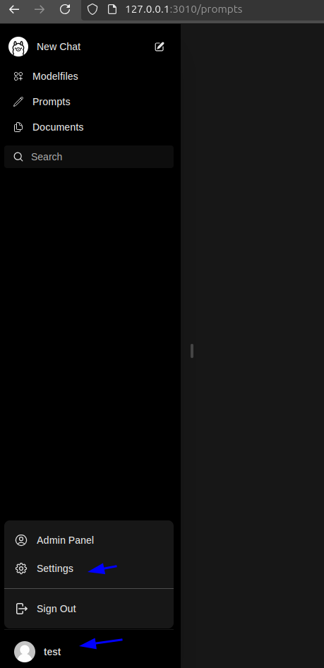
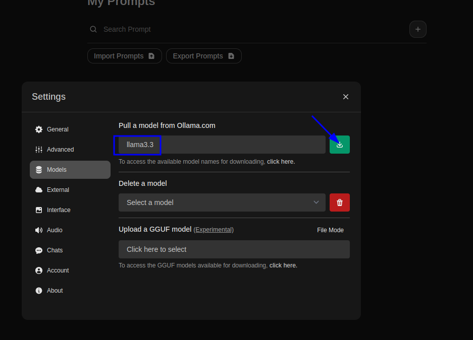
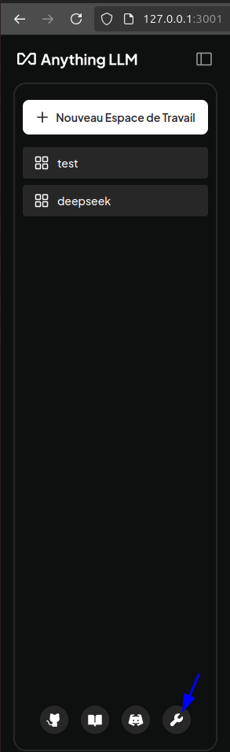
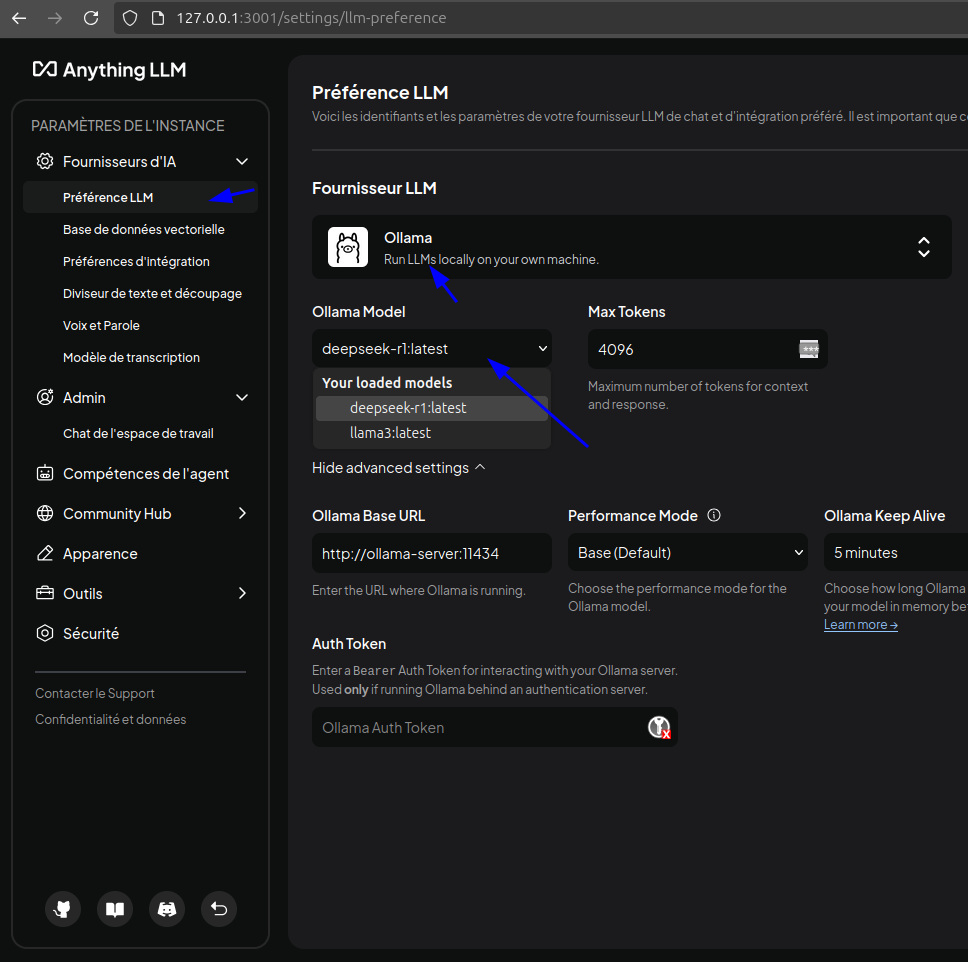

# How to use it ?

The docker-compose.yml file is used to build and run ollamaanythingllm and ollamawebUI, .

### Create folders use in docker compose volumes


```sh
    sudo mkdir -p /opt/ollama/storage;
    sudo mkdir -p /opt/ollama/webui;
    sudo mkdir -p /opt/anythingllm/hotdir;
    sudo mkdir -p /opt/anythingllm/outputs;
    sudo mkdir -p /opt/anythingllm/storage;
    
```

### NVIDIA GPU

Install the NVIDIA Container Toolkit:
```sh
curl -fsSL https://nvidia.github.io/libnvidia-container/gpgkey \
| sudo gpg --dearmor -o /usr/share/keyrings/nvidia-container-toolkit-keyring.gpg
curl -s -L https://nvidia.github.io/libnvidia-container/stable/deb/nvidia-container-toolkit.list \
| sed 's#deb https://#deb [signed-by=/usr/share/keyrings/nvidia-container-toolkit-keyring.gpg] https://#g' \
| sudo tee /etc/apt/sources.list.d/nvidia-container-toolkit.list
sudo apt-get update
```

Configure Docker to use Nvidia driver:

```sh
sudo apt-get install -y nvidia-container-toolkit
```


### Run compose
```sh
    docker-compose up
```
If you want to download models for ollama

get LLM models name available from https://ollama.com/library
and replace XXX by the one you want
```sh
docker exec -it ollama-server ollama run XXXX
```

or 

go to http://127.0.0.1:3010 for ollama webui. 

create dump credentials 

and 

It will give you a simple way to upload new models by get LLM models available from https://ollama.com/library


After that 
go to http://127.0.0.1:3001 for anythingllm here 




You can choose models to chat with


### License

GNU/General Public License (see [license.txt](../license.txt))

This project is licensed as GNU General Public License (v3).

By contributing to this project, you agree that your contributions will be licensed under its GNU General Public License (v3).


